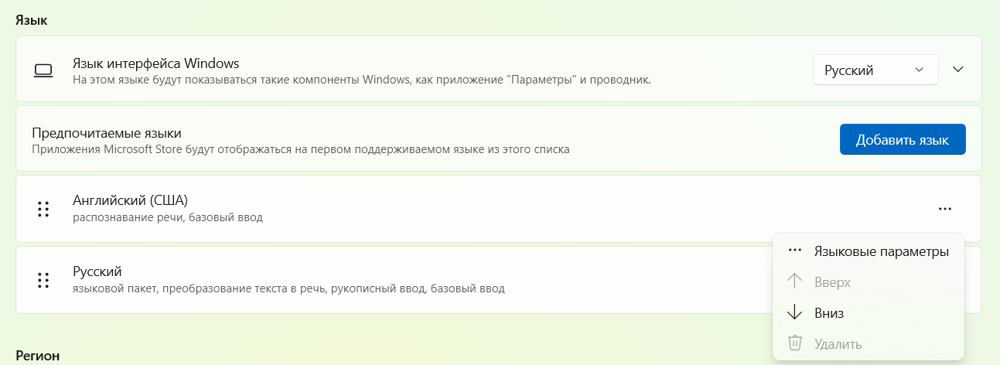

# Что такое Lang Shift
Lang Shift оставляет символы на одной комбинации клавиш, независимо от выбранного языка OS.
## А подробнее
* Устали, что в русской раскладе нужно нажимать <kbd>shift</kbd> + <kbd>7</kbd>, чтобы получить"?", а в английской раскладке достаточно набрать <kbd>?</kbd> ?
* Устали переключаться в английскую раскладку, чтобы набрать символ <kbd>@</kbd> или <kbd>^</kbd> ?
* Устали, что запятая в русской раскладке находится не в основном слое и нужно набирать <kbd>shift</kbd> + <kbd>?</kbd>?

Тогда Lang Shift для вас. Вы всегда получаете нужный символ, какой бы язык операционной системе не выбран.

## Принцип работы
В клавиатуре поддерживается текущий язык, который совпадает с языком в операционной системе. Lang_shift определят пользовательский keycode `LS_SW_LANG`, который переключает язык в клавиатуре и OS.

Библиотека поддерживает указанные символы через пользовательские keycode. По нажатию lang_shift учитывает текущий язык в клавиатуре и отправляет в OS разные keycode. Например, если в клавиатуре английский язык и нажата точка `LS_DOT`, OS получит кейкод `KC_DOT`. А если язык русский - кейкод `KC_SLSH`. OS отобразит символ точки.
| Пользовательский код | Символ | Описание |
| :---         |     :---      |          :--- |
| LS_AT   | @     | Собачка    |
| LS_HASH   |  #    |  Решетка   |
| LS_LCBR   |   {   |  Левая фигурная скобка   |
| LS_RCBR   |    }  |  Правая фигурная скобка   |
| LS_GT   |    >  |   Больше  |
| LS_LT   |     < |   Меньше  |
|LS_LBRC    |    [  |  Левая квадратная скобка   |
| LS_RBRC   |     ] |  Правая квадратная скобка   |
|  LS_LPRN  |   (   |  Левая круглая скобка   |
|  LS_RPRN  |    )  |  Правая круглая скобрка   |
|  LS_SLSH  |     / |  Косая черта, слэш, деление   |
| LS_PIPE   |      \||     |
|  LS_DLR  |  $    |  Доллар   |
|   LS_ASTR |  *    |   Звёздочка, умножение  |
|  LS_CIRC  |   ^   |  Каретка, крыша, домик, circumflex   |
|  LS_BSLS  |   \   |  Обратная косая черта, обратный слэш, backslash   |
| LS_AMPR   |  &    |     |
| LS_PERC   |    %   |  Процент   |
| LS_COLN   |   :   |  Двоеточие   |
| LS_SCLN   |    ;  |   Точка с запятой  |
| LS_QUOT   |    '  |   Прямая одиночная кавычка  |
| LS_DQUO   |    "  |   Прямая двойная кавычка  |
| LS_EXLM   |     ! |   Восклицательный знак  |
| LS_QUES   |     ? |   Вопросительный знак  |
| LS_HYPH   |   -   |   Дефис, минус  |
|  LS_UNDR  |   _   |   Нижнее подчеркивание  |
| LS_EQL   |    =  |  Равно   |
| LS_PLUS   |   +   |  Плюс   |
| LS_DOT   |   .   |   Точка  |
| LS_COMM   |   ,   |  Запятая   |
|   LS_GRV |     ` |  Гравис   |
| LS_TILD   |    ~  |  Тильда   |
|  LS_LYOLO  |  «    |  «Левая ёлочка, французские»   |
| LS_RYOLO   |    »  |  «Правая ёлочка, французские»   |
|  LS_DASH  |   —   |   Тире (длинный дефис)  |
|  LS_NBSP  |       |  Неразрывный пробел   |
|  LS_LPAW  |  „    |  „Левая лапка, немецкие“   |
|  LS_RPAW  |   “   |  „Правая лапка, немецкие“   |
|  LS_LONE  |   ‘   |   ‘Английская левая одинарная кавычка’  |
|  LS_RONE  |   ’   |  ‘Английская правая одинарная кавычка’   |
|  LS_LDBL  |   “|   “Английская левая двойная кавычка”  |
|  LS_RDBL  |   ”   |   “Английская правая двойная кавычка”  |


### А если я переключу язык в OS мышкой?
Чудес не бывает, возникнет ситуация рассинхронизации, в OS будет английский язык, а в клавиатуре русский. Библиотека в таком случае будет отсылать некорректные keycode.

Для синхронизации языка в клавиатуре определен пользовательский код `LS_SW_KB_LANG`. По нажатию язык в клавиатуре синхронизирутеся с OS.

### И как часто бывает рассинхронизация?

Ситуация возникает редко. Чтобы снизить вероятность ее возникновения, рекомендуется при инициализации библиотеки указать тот же язык, что стоит первым в OS. Например, в таком случае рекомендуется первым указать английский язык. Теперь при включении компьютера у клавиатуры и OS будет один язык.


### А если у основного компьютера одна комбинация переключения язык (Win + Space), а у гостевого (например, SSH/RDP или отдельный ноутбук) другая?

Такой сценарий поддерживается. Библиотека определяет пользовательский код `LS_CH_COMBO`, который приводит к смене комбинации переключения языка. Например, если на основном компьютере <kbd>Win</kbd> + <kbd>Space</kbd>, вы нажимаете `LS_CH_COMBO` и клавиатура отправляет в OS другую комбинацию <kbd>Shift</kbd> + <kbd>Alt</kbd>

### Круто, но что-то символов мало поддерживает библиотека

Поддерживаются символы, которые определены в дефолтных русской и английской раскладках. Нет возможности ввести другие символы. Или есть?????

### Так как мне длинный дефис (тире) или кавычки типа ёлочка добавить?

Формально никак, символа нет в русской или английской раскладках, его не добавить. Но есть alt-коды или Unicode, которые добавляют такую возможность. Оба эти метода не дают 100% результат. Lang_shift использует alt-коды. Они работают, только если включена <kbd>Num Lock</kbd>. Добавить длинный пробел можно так.
1. Определяем пользовательский код
```C
enum my_keycodes  {
    LONG_DASH = SAFE_RANGE
}; 
```
2. Добавляем его в LAYOUT на клавиатуре
3. В `process_record_user` при обработке `LONG_DASH` вызываем функцию `ls_sent_alt_code(record, KC_P0, KC_P1, KC_P5, KC_P1)` из библиотеки lang_shift, передавая в качестве аргументов alt-код длинного проблема (0151). Важно использовать keycode с цифрового блока.
```C
bool process_record_user(uint16_t keycode, keyrecord_t *record) {
  ls_process_record_user(keycode, record);
  switch (keycode) {
    case LONG_DASH: {
        ls_sent_alt_code(record, KC_P0, KC_P1, KC_P5, KC_P1);
        return false;
    }  
```
4. Повторите шаги 1-3 для каждого нового символа. Например, для открывающих кавычек типа ёлочка отправьте `ls_sent_alt_code(record, KC_P0, KC_P1, KC_P7, KC_P1)`

## Убедил, как попробовать?
[Инструкция по подключению](/Как%20подключить%20lang%20shift.md)

## А можно на примере реальной клавиатуры?

Конечно, вот на примере [sofle](/firmware/qmk/sofle)

## Плюсы
* Не требует установки в OS софта, работает без смены системной прошивки
## Минусы
* Поддержка только QMK.
* Поддерживается только конфигурация из двух настроенных языков (русский и английский), а также дефолтные раскладки для них.
* Требует ручной компиляции прошивки, нет интеграции с VIA/VIAL.

## Известные проблемы
* Раздел обновляется

## Вдохновление
https://github.com/klavarog/lang_shift
